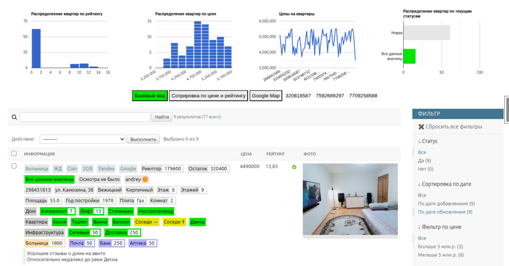

# Цель проекта

Создать «нечто», что поможет при решении вопроса, связанного с выбором квартиры для ее дальнейшей покупки.

# Какую проблему решаем

Большинство ресурсов по продаже/покупке недвижимости не предоставляют в общий доступ аналитических инструментов, которые могли бы помочь в решении вопроса, связанного с выбором недвижимости для ее дальнейшей покупки. В данном проекте решалось две основных задачи. Первая — это аккумуляция и агрегация данных в одном месте с возможностью дальнейшей обработки. Вторая — это реализация механизма, который поможет выбрать тот или иной вариант квартиры на основании простых, понятных и просто интерпретируемых параметрах.

# Как решалась задача

